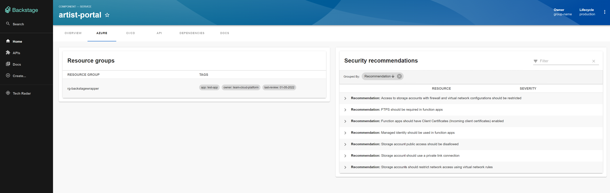

# @vippsno/plugin-azure-resources

A Backstage frontend plugin that adds an **Azure** tab to catalog entity pages, showing Azure resource groups, security recommendations, and cost advice — all scoped to the entity via an Azure tag.



## Features

- **Resource groups** — lists Azure resource groups that match the entity's tag, with links to the Azure portal
- **Security recommendations** — Microsoft Defender for Cloud recommendations, grouped by finding and sorted by severity
- **Cost advisor** — Azure Advisor cost recommendations with estimated savings

## Prerequisites

Install and configure the [backstage-azure-resources-backend](https://github.com/ehrnst/backstage-azure-resources-backend) plugin first.

## Installation

This plugin targets the **Backstage new frontend system** (`createApp` from `@backstage/frontend-defaults`).

### 1. Copy the plugin into your Backstage workspace

The plugin must live inside your Backstage workspace to share a single React instance with the host app. Add the source under `plugins/azure-resources/` and register it as a workspace package:

```json
// backstage/plugins/azure-resources/package.json
{
  "name": "@vippsno/plugin-azure-resources",
  "private": true,
  "backstage": { "role": "frontend-plugin" },
  "exports": {
    ".": "./src/index.ts",
    "./alpha": "./src/alpha.ts",
    "./package.json": "./package.json"
  }
}
```

```json
// packages/app/package.json
{
  "dependencies": {
    "@vippsno/plugin-azure-resources": "workspace:*"
  }
}
```

### 2. Register the plugin in your app

```ts
// packages/app/src/App.tsx
import azureResourcesAlpha from '@vippsno/plugin-azure-resources/alpha';

const app = createApp({
  features: [
    // ... other plugins
    azureResourcesAlpha,
  ],
});
```

### 3. Enable extension discovery

```yaml
# app-config.yaml
app:
  packages: all
```

That's it. The Azure tab appears automatically on any entity that has the `azure.com/tag-selector` annotation.

## Annotation

Add the following annotation to a catalog entity:

```yaml
metadata:
  annotations:
    azure.com/tag-selector: key/value
```

The plugin uses the tag key and value to query Azure Resource Graph for matching resources. For example:

```yaml
annotations:
  azure.com/tag-selector: owner/team-platform
```

## Development

```bash
yarn install
yarn lint
yarn test
```
